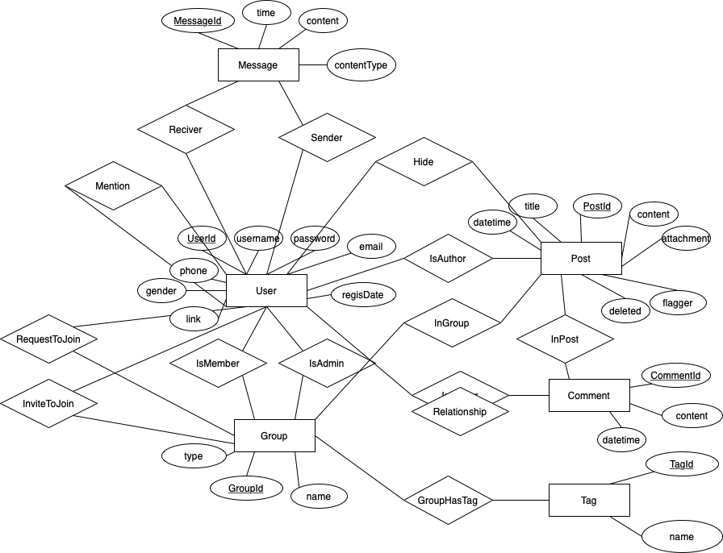

## ER Diagram, and database schema
For schema, please refer to server/database_schema.txt

## Wireframe & Prototype
[Figma for wireframe & prototype](https://www.figma.com/file/n99Cx3dItqtl2d68DVsool/Project?node-id=243%3A1)

## Security Checks
### User Cookie
After logging in, the cookie would be sent with the response to user. The broswer would automatically save the cookie, and all requests expcet login and registration requires a cookie.
The cookie encapsulates username and password information and is encrypted with aes-256 algorithm.
### Access control
For adding,deleting admin, handling requests to join groups, deleting posts and comments, we all implemented access control at the backend to verity the user is in certain group.
### Account lockout policy
After 3 unsuccessful login attemps, we would lock the user out for five minutes.
### Using .env file
We used .env files to store database profiles.
### Input validation
For password, we validate that the inputed password is alphanumeric and has minimum length of 6.